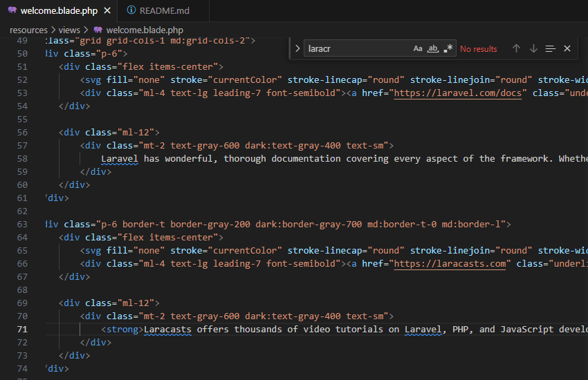
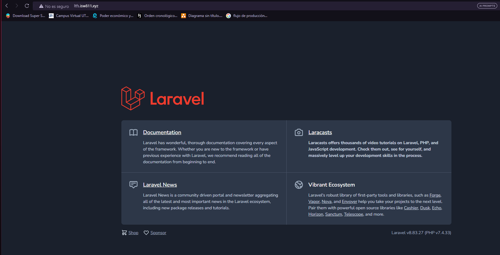
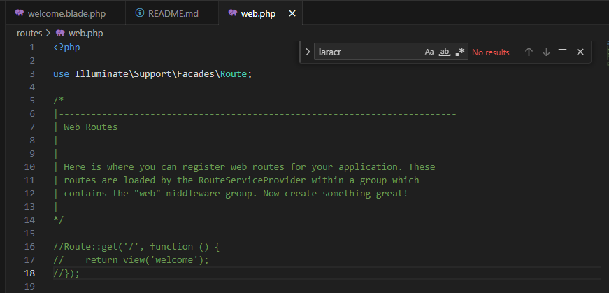
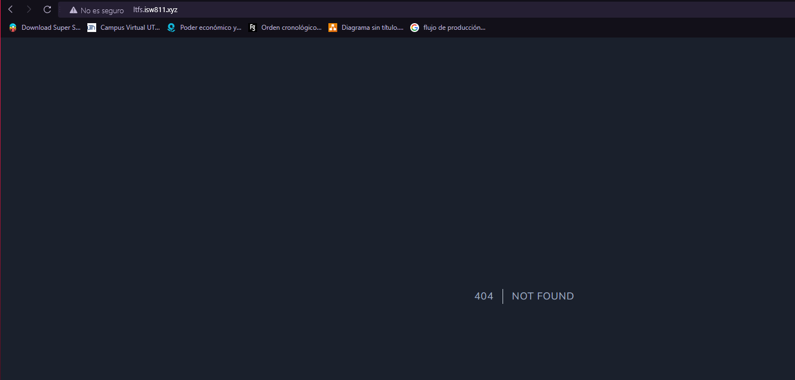
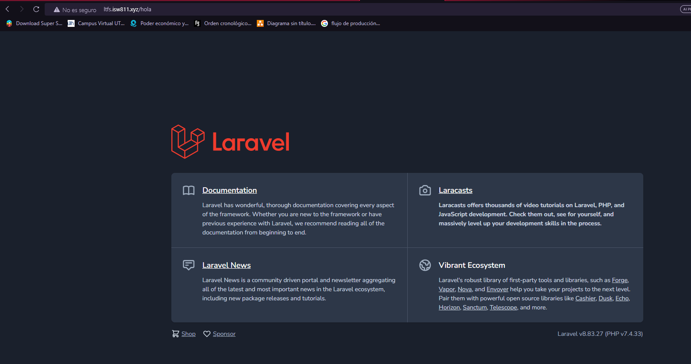

# Entregable proyecto

 ## capitulo 5

 ### Iniciar la maquina
 Primero iniciamos la maquina virtual donde tenemos alojados los sitios que creamos
 ```bash
cd /
cd D
cd isw811
cd VMs
cd webserver
vagrant up
```

### Editar un poco el documento 
Editar un poco el documento welcome.blade.php con un bold para ver si la pagina funciona correctamente, agregamos la etiqueta "<strong>" en la linea 71.

Antes del cambio


Se agrega la etiqueta



Visualización después del cambio en la parte de Laracasts


### Ver las rutas 
Para poner a prueba las rutas debemos ir al documento web.php y primero debemos comentar la linea 16 hasta la 18 para saber si funciona todo bien.

modificando la ruta


Pagina con la ruta modificada


Y si modificamos las rutas, podemos acceder desde las rutas que modificamos y retornando la vista que deseemos 





## Capitulo 6

### Editar la pagina