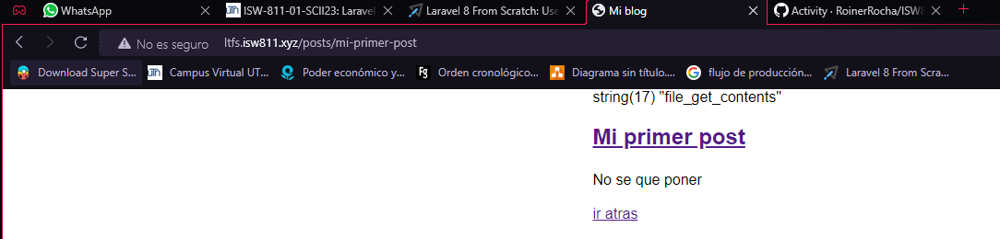
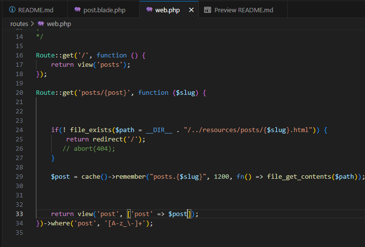
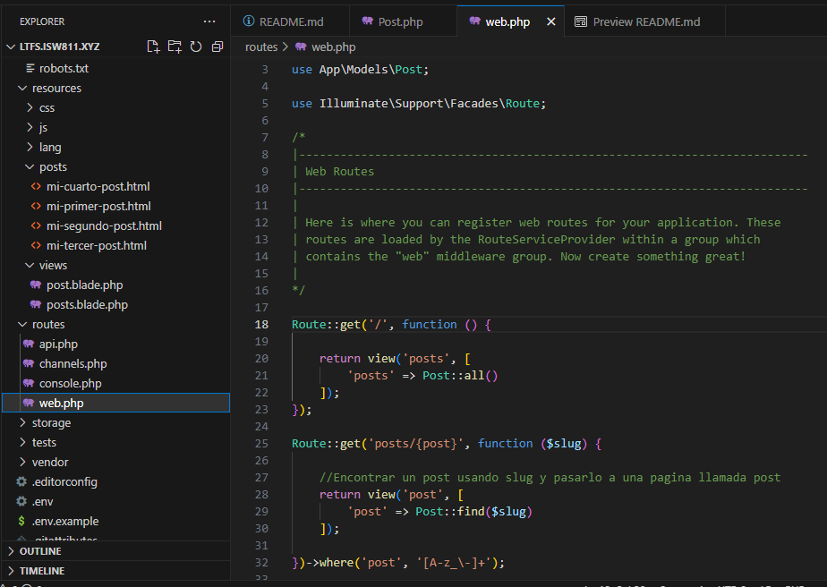
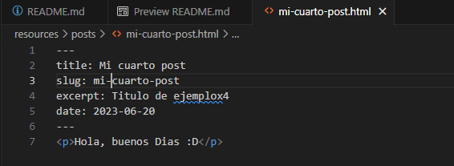
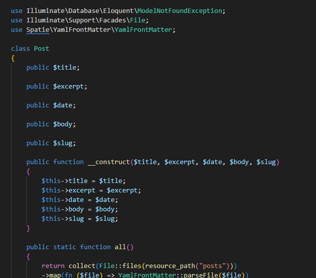
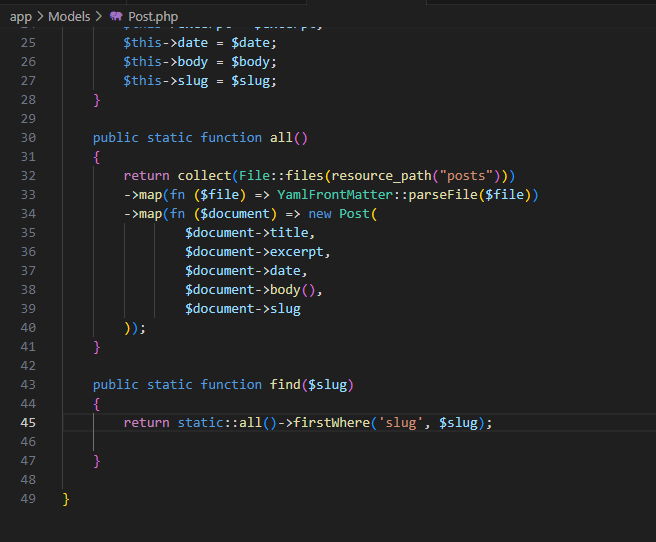

# Entregable proyecto

Clicking [this link](#)

 ## capitulo 5

 ### Iniciar la maquina
 Primero iniciamos la maquina virtual donde tenemos alojados los sitios que creamos
 ```bash
cd /
cd D
cd isw811
cd VMs
cd webserver
vagrant up
```

### Editar un poco el documento 
Editar un poco el documento welcome.blade.php con un bold para ver si la pagina funciona correctamente, agregamos la etiqueta "<strong>" en la linea 71.

Antes del cambio


Se agrega la etiqueta


Visualización después del cambio en la parte de Laracasts


### Ver las rutas 
Para poner a prueba las rutas debemos ir al documento web.php y primero debemos comentar la linea 16 hasta la 18 para saber si funciona todo bien.

modificando la ruta


Pagina con la ruta modificada


Y si modificamos las rutas, podemos acceder desde las rutas que modificamos y retornando la vista que deseemos 


## Capitulo 6

### Editar la pagina
En esta parte editamos la pagina de laravel y colocamos un "hola mundo"


imagen de la pagina


### Modificacion del css
Primero se debe crear un archivo llamado app.css en el folder de public


Ahora agregamos los cambios al archivo css


Ahora enlazamos el link del css en el html de la siguiente forma


### Agregar el js
Agregamos el js de la misma forma en la que agregamos el css


Ahora modificamos el js de la siguiente forma


y lo enlazamos de la siguiente manera


Y a la hora de probarlo nos saltará la siguiente alerta


## Capitulo 7

### Cambiar la vista de la pagina
 Ahora se debe cambiar cual es la pagina que se desea observar en el archivo web


Una vez realizado el cambio se debe verificar, es normal que la pagina no se encuentre debido a que no esta creada aun 


Ahora a la view de welcome la editamos y le cambiamos el nombre a "posts"


Y comprobamos que la pagina siga funcionando


Ahora se debe eliminar el archivo js que habíamos creado anteriormente para evitar retrasos


Debemos actualizar el css para la pagina y ver la pagina para ver si todo funciona correctamente


Ahora debemos crear un "article" con un titulo y un párrafo y observar como se ve el resultado final


Ahora se deben agregar mas cambios al css y observar el resultado


Ahora se deben agregar mas artículos y agregarle estilos


Ahora se debe añadir mas artículos y arreglarlos con css


En el archivo de web se debe crear una nueva vista, vista la cual crearemos en la carpeta donde esta "posts", en la nueva vista realizaremos una copia del html de la otra pagina


Se le debe agregar un enlace a la pagina actual para que nos lleve a la nueva pagina, la cual no funcionará debido a que no ha sido creada


Una vez creada la nueva pagina se le debe agregar un "href" a los titulos para que nos lleven a la pagina anterior


Tambien se le agregó un enlace en la parte inferior


## Capitulo 8

Para este capitulo se modificó las rutas en el archivo de "web" de una forma eficaz para que si en el enlace colocamos el nombre de nuestra pagina, este aparezca, en cambio si no existe nos manda a la pagina principal


Para que la anterior configuración de ruta funcione, se crearon 3 paginas html diferentes en un nuevo folder llamado posts, los cuales los llama la pagina de post.blade.php con el siguiente código


Una vez realizado y creado los cambios, es importante asegurarse que todo se encuentre bien escrito y ver que funcione, para esto agregamos un poco de información a las nuevas paginas html y comprobamos el funcionamiento


## Capitulo 9

En este capitulo se realizó una forma mas ordenada que detectar las paginas que se crean que contengan caracteres especiales o números, también se puede ver un código especial "ddd" el cual sirve para ver los fallos en la pagina


## Capitulo 10

Esta vez lo que se realizó fue el aprendizaje del uso de cache para ver datos guardados cada cierta cantidad de tiempo 






## Capitulo 11

En este capitulo se usaron las clases en el folder de Models y sobre las nuevas formas de formas de mostrar todos los posts en una misma pagina y no en paginas diferentes con un array


Se configuraron las rutas de forma adecuada para que fueran realizadas con las clases que se crearon anteriormente 



En la view de posts se realizó un foreach gracias a las clases para lograr que las paginas se muestren todas en una misma


## Capitulo 12

Es esta ocasión en el archivo "web" se modificó varias veces pero el resultado final del archivo fue que el archivo obtuvo una funcion capaz de encontrar la pagina que solicitamos mediante un "find" que recibe como parametro el "slug" el cual es un metadata el cual contiene nombre de nuestra pagina.


El meta data que se encargará de localizar nuestra pagina se encuentra en cada una de los html que creamos. 




El archivo "Post.php" fue el que mas se vio modificado debido a que gracias que es una clase, podemos tratar los titulos y las etiquetas del html como objetos, y asi que la clase navegue y cuando encuentre los datos correspondientes, los muestra






Por ultimo, las vistas tambien vieron reflejados cambios pero con el único fin de que muestre la información solicitada mediante el código correspondiente 


## Capitulo 13


