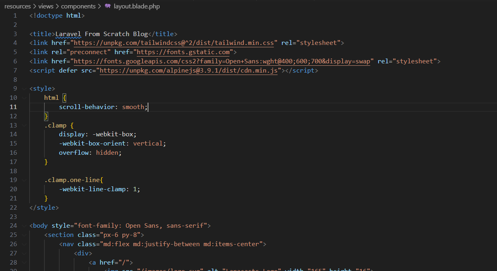
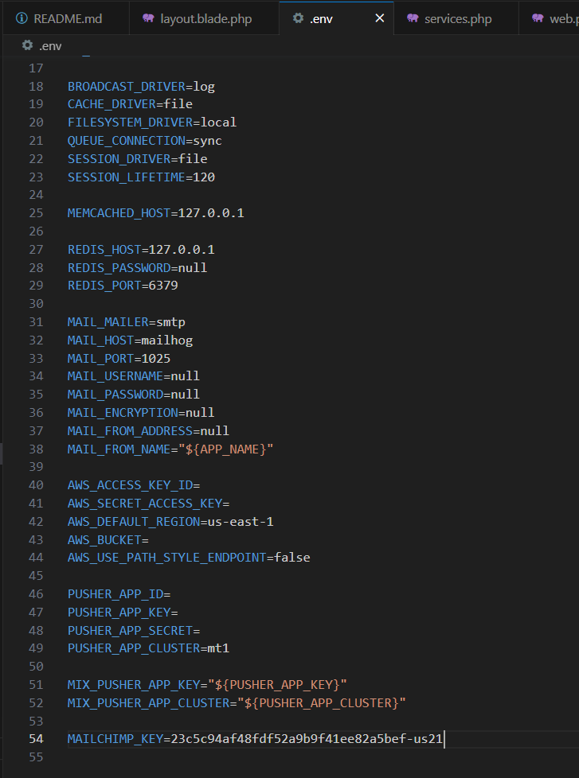
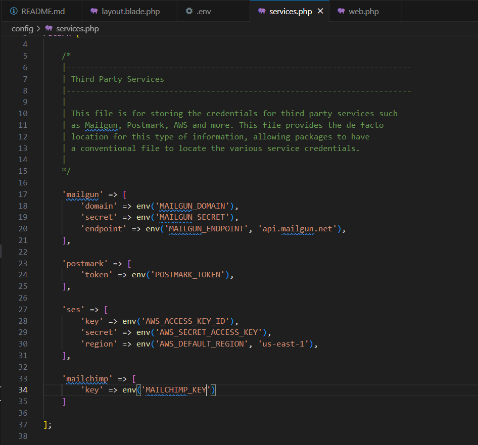
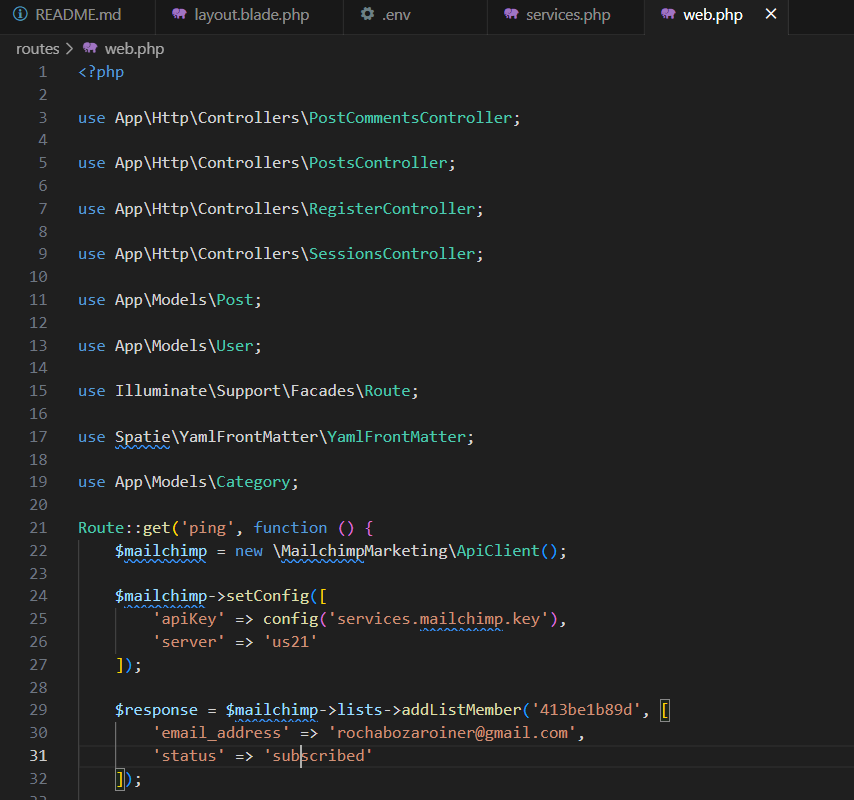
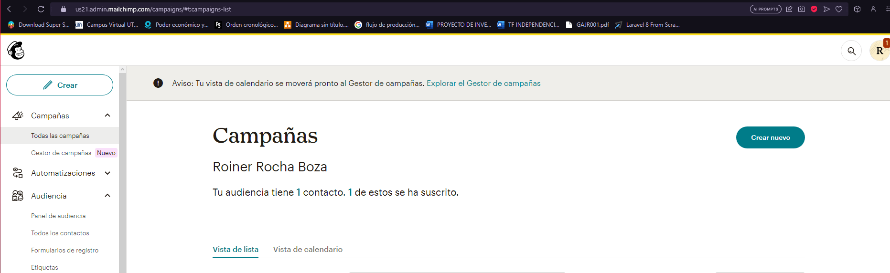
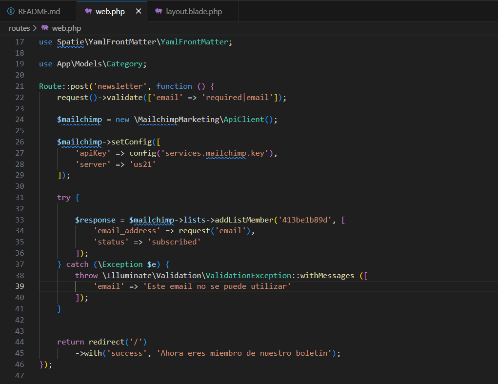
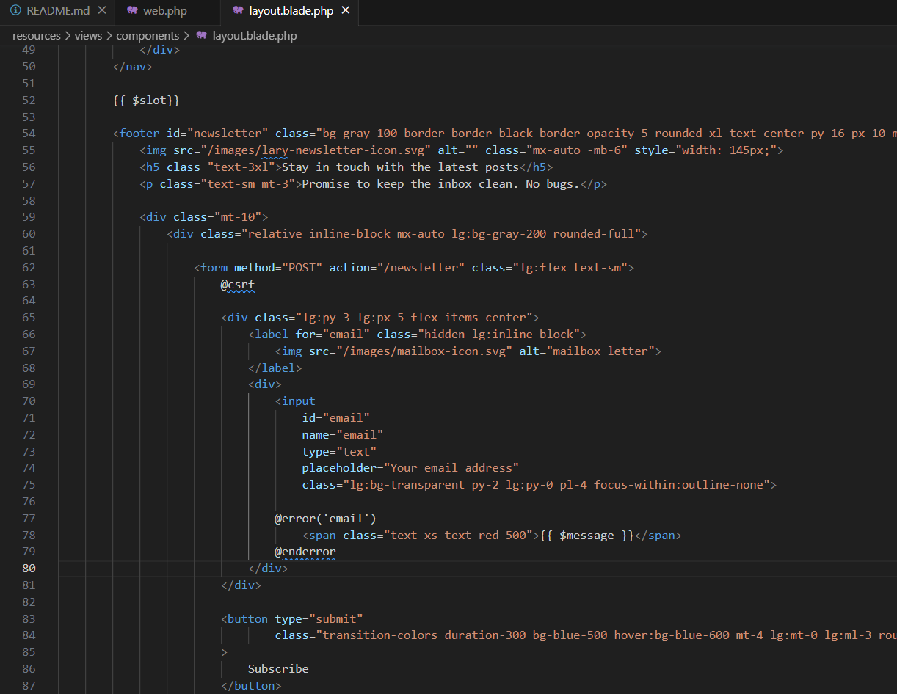
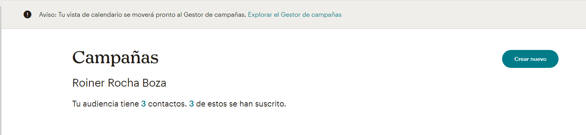

# Entregable proyecto #3

## Indice Sección 11

 Ingresar al [capitulo 58](#capitulo-58)

 Ingresar al [capitulo 59](#capitulo-59)

 Ingresar al [capitulo 60](#capitulo-60)

 Ingresar al [capitulo 61](#capitulo-61)

 ## Capitulo 58

 En esta ocasión realizamos una cuenta en mailchimp para utilizar una apikey que nos provee ese sitio y se realizó una animación la cual da mas fluidez a la hora de ir de un sitio a otro en la pagina

 ### Estilos agregados 

 

 ### Se agrega el token de mailchimp al archivo .env

 

 ### Se configura apropiadamente el mailchimp en los servicios

 

 ### Se configura la ruta en el archivo web para agregar a un participante a una campaña y ver si la api funciona correctamente

 

 ### Resultado de la pagina (Si funciona)

 

## Capitulo 59

Para este capitulo aprendimos sobre como hacer que en nuestro footer, podamos registrar un nuevo correo

### Resultado del codigo para que se nos mande un mensaje para saber si se puede usar ese email o no

### Se modifica el footer para obtener el email que el usuario ingresa 

### A la hora de ingresar 2 correos mas, nos aumentan el numero de usuarios en la campaña

## Capitulo 60

