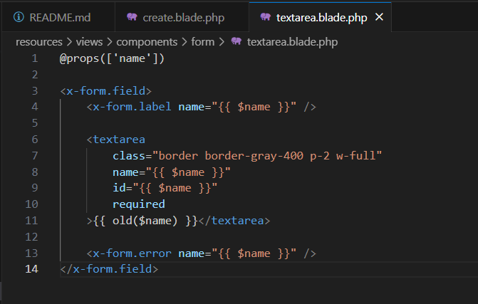

# Entregable proyecto #3

## Indice Sección 12

 Ingresar al [capitulo 62](#capitulo-62)

 Ingresar al [capitulo 63](#capitulo-63)

 Ingresar al [capitulo 64](#capitulo-64)

 Ingresar al [capitulo 65](#capitulo-65)

 Ingresar al [capitulo 66](#capitulo-66)

 Ingresar al [capitulo 67](#capitulo-67)

 Ingresar al [capitulo 68](#capitulo-68)

 Ingresar al [capitulo 69](#capitulo-69)

 ## Capitulo 62

 En esta aprendimos sobre como hacer que un usuario obtenga el rol de administrador 

 ### Primero debemos agregar middleware del archivo administrador en el archivo del kernel

 

 ### Se codifica el archivo del administrador de forma que solo deje acceder al usuario que le asignemos

 

 ### Configuramos la vista para el administrador y ver si todo funciona bien

 

 ### Se configura el controlador del post con la vista que creamos

 

 ### Se configura la ruta adecuadamente con el middleware que añadimos

 

 ### Resultado

 

## Capitulo 63

En este capitulo creamos un formulario para hacer un post y se le añadio la funcionalidad respectiva

### Se crea un formulario para crear posts y se agregan las categorias y los espacios asignados

### Asiganmos los campos del controlador para publicarlos en los posts

### Creamos la ruta para que se almacenen los datos que el usuario inserte en el formulario

### Resultados

## Capitulo 64

Para este capitulo aprendimos sobre como colocar imagenes y insertarlas en la base de datos de la siguiente forma

### Agregamos el espacio para agregar la foto que deseamos insertar

### En el archivo de filesystem cambiamos un poco el codigo para que estas se almacenen en el folder de public y lo mismo lo hacemos en el archivo .env

### En en controlador del post, le asignamos el espacio para agregar la imagen, lo mismo hacemos en el archivo de la migracion 

### Se configura la ruta para mostrar las imagenes en la pagina

### Resultado de las paginas con las imagenes

## Capitulo 65 
Para este capitulo unicamente se limpio un poco mas el codigo del archivo create, moviendo los componentes del formulario como el body, title, entre otros, a un archivo por aparte para solo importarlo en el archivo de la pagina

### Codigo modificado para asignarle el $name el cual nos detecta el dato que queremos insertarle

### Resultado final

## Capitulo 66

En este capitulo realizamos modificaciones al panel de realizar un post, dandole un nuevo diseño

### Se realizan diferentes componentes y se importan en el lugar de los archivos correspondientes, dejando asi el codigo de la pagina principal, mucho mas limpio y agradable a la vista

### Codigo de la pagina 

### Codigo del dropdown

### Codigo de la pagina

## Capitulo 67

Para este capitulo realizamos una modificacion a la vista de moderador, logrando asi poder editar los posts, verlos y eliminarlos. Entre los cambios mas importantes podemos encontrar

### Creacion de los routes para lograr editar, eliminar o movernos a las paginas de editar el contenido

### Crear las funciones que nos permitirán modificar o eliminar  los posts que creemos

### Creacion de un index para ver todos los posts que hay hasta el momento y las opciones para editarlo o eliminarlo

### Creacion de la pagina para editar el post

### Resltados del dashboard

### Se edita un articulo 

### En la pagina principal podremos verlo ya editado

 

