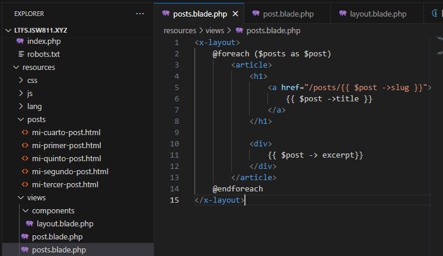
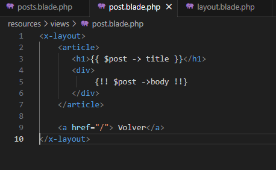

# Entregable proyecto

## Indice Sección 3

 Ingresar al [capitulo 14](#capitulo-14)

 Ingresar al [capitulo 15](#capitulo-15)

 Ingresar al [capitulo 16](#capitulo-16)

 Regresar [Al indice principal](../README.md)

 ## Capitulo 14

 En este aprendizaje, se logró observar que el la manipulación del html mediante un archivo .blade.php puede llegar a resultar mucho mas sencillo que como si el archivo fuera solo .php, gracias a esto se puede simplificar muchísimo el código a la hora de programar 

 

 

## Capitulo 15

En esta ocacion el codigo no se vio muy alterado, en su lugar, se realizó una forma para que todo se vea muy ordenado y disminuyendo asi la cantidad de código al no tener que colocar "@section" o elementos asi, en su lugar simplemente se coloca la etiqueta "x-layout" para incluir todo el contenido de nuestra pagina

## Capitulo 16

Para la elaboración de este trabajó, unicamente se modificaron los archivos "web.php" y el archivo "Post.php" Con el fin de que cuando el usuario escriba mal el url el nombre de algunas de las paginas y esta no sea detectada, se le muestre un mensaje 404

