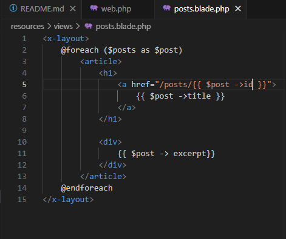

# Entregable proyecto

## Indice Sección 4

 Ingresar al [capitulo 17](#capitulo-17)

 Ingresar al [capitulo 18](#capitulo-18)

 Ingresar al [capitulo 19](#capitulo-19)

 Ingresar al [capitulo 20](#capitulo-20)

 Ingresar al [capitulo 21](#capitulo-21)

 Ingresar al [capitulo 22](#capitulo-22)

 Ingresar al [capitulo 23](#capitulo-23)

 Ingresar al [capitulo 24](#capitulo-24)

 Ingresar al [capitulo 25](#capitulo-25)

 Ingresar al [capitulo 26](#capitulo-26)

 Ingresar al [capitulo 27](#capitulo-27)

 ## Capitulo 17

En esta ocasión se realizó la inspección y creación de la base de datos, debido a que muchos de los pasos que se muestran en el video como el "migrate" ya los habiamos realizado en clases, actualmente poseemos la base de datos en una nueva maquina virtual y en el video se nos enseñó como acceder a la base de datos creadas con "user (nombre de la base de datos);" y saber cuantas tablas tenemos con "show tables;", ademas descargamos una aplicacion para el dominio de la base de datos en el futuro

### Ingreso y validacion de los datos en la aplicacion descargada

 

 

 ### Comandos usados en la maquina virtual de base de datos

 

## Capitulo 18

Para la realización de este ejercicio se creo la tabla en la aplicación de la base de datos, también pudimos ver las migraciones en el código. Tambien se pudo apreciar el uso de "php artisan migrate: rollback", el cual puede eliminar las tablas creadas y volver el batch a 1, y se advirtió sobre el uso de "php artisan migrate: fresh" debido a que puede borrar todos los datos de tus tablas.

### Base de datos

## capitulo 19

En esta ocasión se utilizaron los comando por consola para estudiar mejor la base de datos Primero en la maquina virtual de webserver nos dirigimos a la carpeta de la pagina y ahí realizamos los cambios correspondientes.

### Asignar datos a la tabla
Se le asignó un dato a cada elemento de la tabla como el nombre, email y la contraseña encriptada gracias al bcrypt, si se guardó correctamente lo podemos ver en la aplicación de la base de datos.

### Nuevos comandos

También se realizaron la ejecucion de algunos nuevos comandos cono el "User::find(1);", el cual permite encontrar al usuario con el id 1, también el comando "User::all();", el cual nos permite ver todos los usuarios que tenemos registrados en la base de datos o tambien el comando "$user ->pluck('name');" el cual nos permite encontrar todos nos nombres que se encuentren en la base de datos, pluck nos traerá todos los datos de lo que le solicitemos

## Capitulo 20

En esta ocasión se creo una tabla para los posts con su información correspondiente, luego, se eliminaron los html debido a que ya no los íbamos a ocupar gracias a que los post los creamos en la bases de datos, se modificaron las rutas para traer la información de la base de datos y mostrarla en nuestras paginas gracias a que se busca la información en base al id.

### Resultado de la pagina

### Modificación del código de las rutas y las views

### Como crear un nuevo model usando la console

## Capitulo 21

En esta ocasión se realizó un arreglo a la estructura del html usando algunos de los comandos que se vieron anteriormente, Es importante corregir el código de las views debido a que si no se hace apropiadamente, el html no se renderizará adecuadamente

###  Agregado de la etiqueta 
 para un mejor espaciado

### Agregado de la etiqueta strong

### Resultado de la pagina

### Configuracion de las vistas 
Los signos de !! se agregan con el fin de tener un mejor control sobre el html, permitiendo asi que no se produzcan errores como por ejemplo que las etiquetas se vean en nuestra pagina.

## Capitulo 22

En esta ocasión se ha logrado insertar de datos de diferentes formas

### Forma de fillable
Insertando todos los datos como si fuera una lista, insertando la casilla de la tabla y su respectiva información, es importante escribir en el código de Post.php los datos que se desean ingresar, debido a que podemos editar información como el id

### Forma Guarded
En esta forma en lugar de añadir los datos que deseamos agregar, añadimos los datos que no se desean añadir, en el siguiente ejemplo se usó el id, como el dato de id ya no se inserta entonces el id será auto incrementado

## Capitulo 23

En esta ocasión se le agregó un "slug" a la base de datos, para que de este modo las paginas ya no sean buscadas por el id sino por el slug, cuando todo se encuentre bien configurado, el slug se mostrará en el url de nuestra pagina

### Configuración del slug en el código

### Agregar el slug a la base de datos y hacer que sea buscado por el mismo

## Capitulo 24

Para la ejecución de este ejercicio se creó una tabla llamada categorías y se le agrega a la tabla de post un nuevo dato llamado "category_id" el cual va a enlazar el id de la categoria con el post

### Vista del resultado

En las paginas se puede ver que la categoria de heroes es visible para el usuario

### Vista del código

### Vista de la pagina

### Vista del bd

## Capitulo 25

Para la realización de este ejercicio se agregó un nuevo archivo a la carpeta de models llamado Category para enlazarlo con los posts y asi cuando le demos click a la categoría en nuestra pagina, nos lleve solo a los post con esa categoría

### Configuración de los archivos category y post

### Configuración del código de las paginas

### Resultado de vista de las paginas
Si se le da click en la categoría nos va a llevar a los posts con esa categoría

## Capitulo 26

Para este capitulo no se realizaron muchos cambios, unicamente se utilizó un código especial para poder ver las veces que ingresamos a la pagina, ademas se descargó una extension para lograr ver los querys que se ejecutan y el tiempo de respuesta

### código del archivo web

### código de la extension clockwork

## Capitulo 27

Para esta ocasión se realizó una forma mucho mas simple de agregar los datos a varias tablas y crear los post al mismos tiempo, en la carpeta seeders debemos buscar el archivo databaseSeeder y realizar las siguientes modificaciones. 

### Creación de los datos de las tablas

Se debe agregar el truncated para evitar que los datos que ingresamos de la siguiente forma, se repitan en las siguientes casillas de las tablas

### Creación de los posts

Se crean los posts con la información que irán en los datos de las tablas

### Cambios en el migración 
En el caso de posts se le agrega un espacio mas, el cual es el user_id para enlazar al usuario con el post y se le agrega el atributo unique para evitar que otro post tenga la misma información

En el caso de categories se le agrega un unique al nombre y al slug, con la intención de evitar información repetida

### Cambio en el archivo post.balde, Post.php y User.php
Se agregó a la vista el usuario que diseñó el post

Configuración realizada post.php y user.php para que sea posible leer el usuario y mostrarlo en la vista

### Comando para ejecutar todas las tablas y los post en conjunto en la maquina virtual

### Resultado de la pagina

