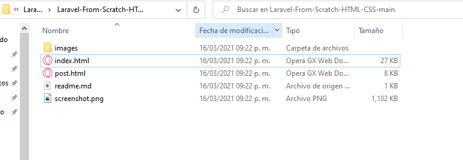
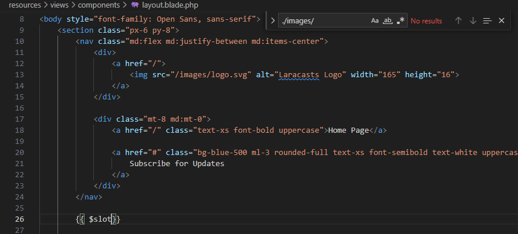
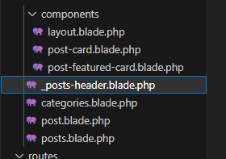
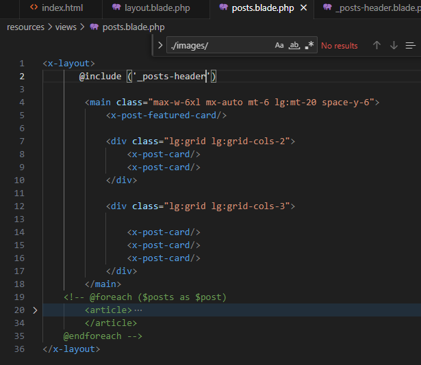
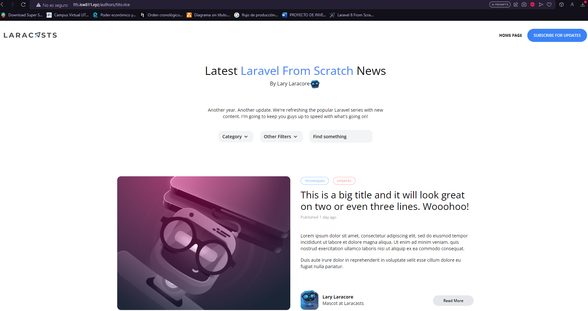
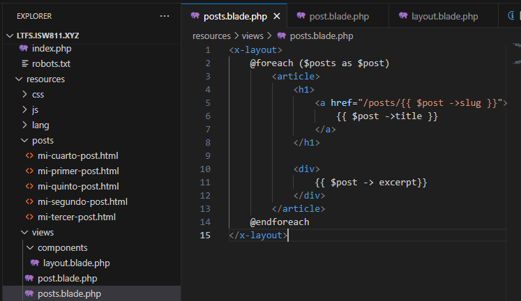
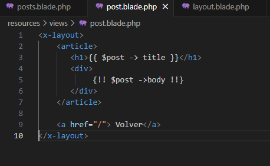
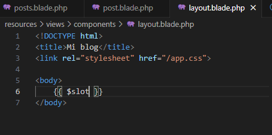
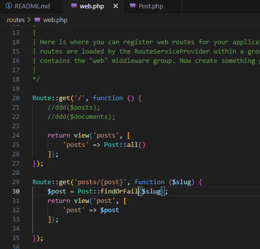
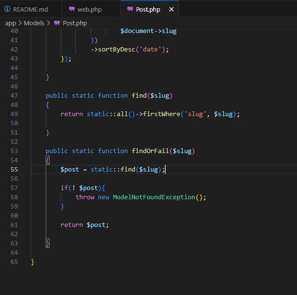

# Entregable proyecto

## Indice Sección 3

 Ingresar al [capitulo 32](#capitulo-32)

 Ingresar al [capitulo 33](#capitulo-33)

 Ingresar al [capitulo 34](#capitulo-34)

 Ingresar al [capitulo 35](#capitulo-35)

 Ingresar al [capitulo 36](#capitulo-36)

 ## Capitulo 31
  En esta oportunidad, se nos solicitó descargar un archivo el cual contiene unas imágenes y un index el cual vamos a utilizar

 

 ### Configuración de la nueva pagina
 En la carpeta components se debe encontrar un archivo layout que creamos en unas de las secciones anteriores. En ese archivo debemos copiar el index del archivo y agregar {{$slot}} entre el header y el footer 

 

 ### Cards
 Se crearon nuevos componentes y vistas con el fin de controlar mejor el html

 

 ### Nuevo posts
 Cada componente anterior posee una parte del html anterior según su nombre
 y cada uno de estos componentes es llamado en posts

### Resultado
El resultado de la pagina al final fue el siguiente

## Capitulo 32

En esta ocacion el codigo no se vio muy alterado, en su lugar, se realizó una forma para que todo se vea muy ordenado y disminuyendo asi la cantidad de código al no tener que colocar "@section" o elementos asi, en su lugar simplemente se coloca la etiqueta "x-layout" para incluir todo el contenido de nuestra pagina

## Capitulo 33

Para la elaboración de este trabajó, unicamente se modificaron los archivos "web.php" y el archivo "Post.php" Con el fin de que cuando el usuario escriba mal el url el nombre de algunas de las paginas y esta no sea detectada, se le muestre un mensaje 404

## Capitulo 34

Para la elaboración de este trabajó, unicamente se modificaron los archivos "web.php" y el archivo "Post.php" Con el fin de que cuando el usuario escriba mal el url el nombre de algunas de las paginas y esta no sea detectada, se le muestre un mensaje 404

## Capitulo 35

Para la elaboración de este trabajó, unicamente se modificaron los archivos "web.php" y el archivo "Post.php" Con el fin de que cuando el usuario escriba mal el url el nombre de algunas de las paginas y esta no sea detectada, se le muestre un mensaje 404

## Capitulo 36

Para la elaboración de este trabajó, unicamente se modificaron los archivos "web.php" y el archivo "Post.php" Con el fin de que cuando el usuario escriba mal el url el nombre de algunas de las paginas y esta no sea detectada, se le muestre un mensaje 404

