# Entregable proyecto

## Indice Sección 3

 Ingresar al [capitulo 32](#capitulo-32)

 Ingresar al [capitulo 33](#capitulo-33)

 Ingresar al [capitulo 34](#capitulo-34)

 Ingresar al [capitulo 35](#capitulo-35)

 Ingresar al [capitulo 36](#capitulo-36)

 ## Capitulo 31
  En esta oportunidad, se nos solicitó descargar un archivo el cual contiene unas imágenes y un index el cual vamos a utilizar

 

 ### Configuración de la nueva pagina
 En la carpeta components se debe encontrar un archivo layout que creamos en unas de las secciones anteriores. En ese archivo debemos copiar el index del archivo y agregar {{$slot}} entre el header y el footer 

 

 ### Cards
 Se crearon nuevos componentes y vistas con el fin de controlar mejor el html

 

 ### Nuevo posts
 Cada componente anterior posee una parte del html anterior según su nombre
 y cada uno de estos componentes es llamado en posts

### Resultado
El resultado de la pagina al final fue el siguiente

## Capitulo 32

En esta oportunidad se modificó un poco el html para que pueda ser importado desde los demás componentes con la información de nuestra base de datos

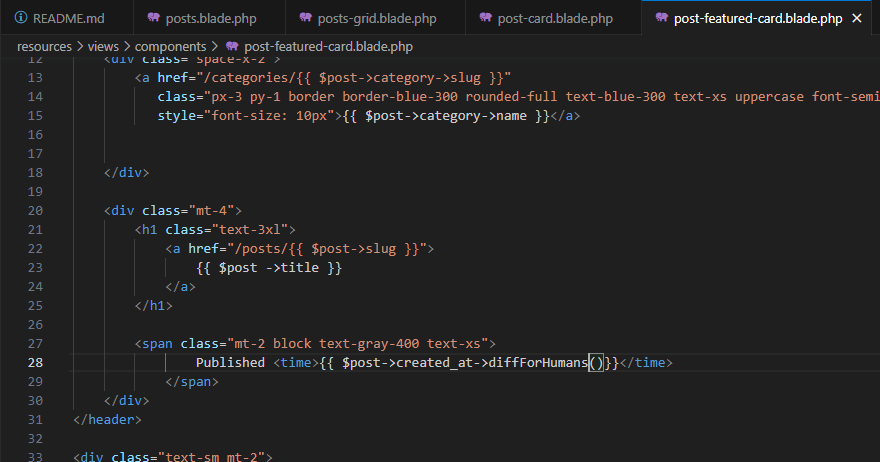

### Merge de estilos para las paginas

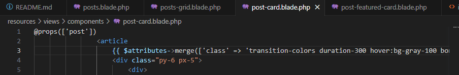

### Modificación del CSS

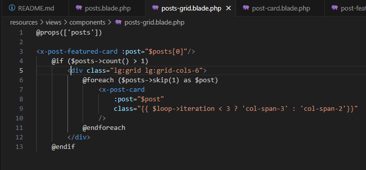

### Configuración de la vista 

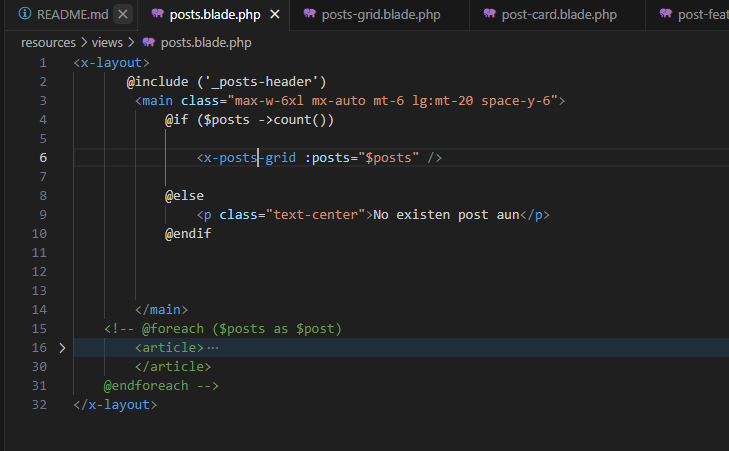

### Resultado

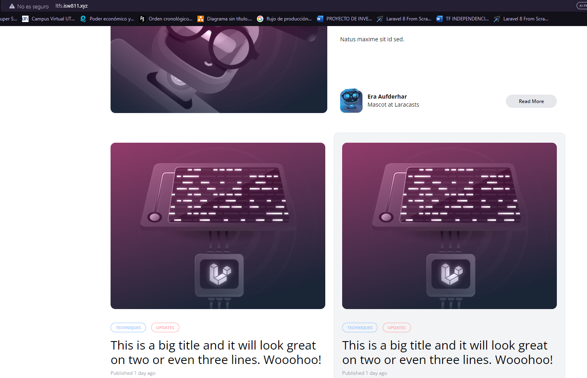

## Capitulo 33

Para la elaboración de este trabajó se logró que la pagina sea mucho mas dinámica al eliminar los datos que estaban quedamos y agregando los datos de nuestra base de datos, además de agregar una nueva vista y hacerle las mismas modificaciones que en en la otra pagina

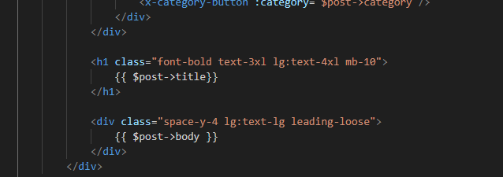

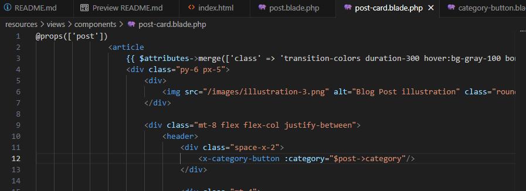

### Se separó las categorias en un componente para poder importarlos mas facil despues

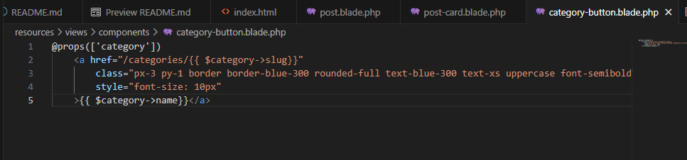

### Resultado de las paginas

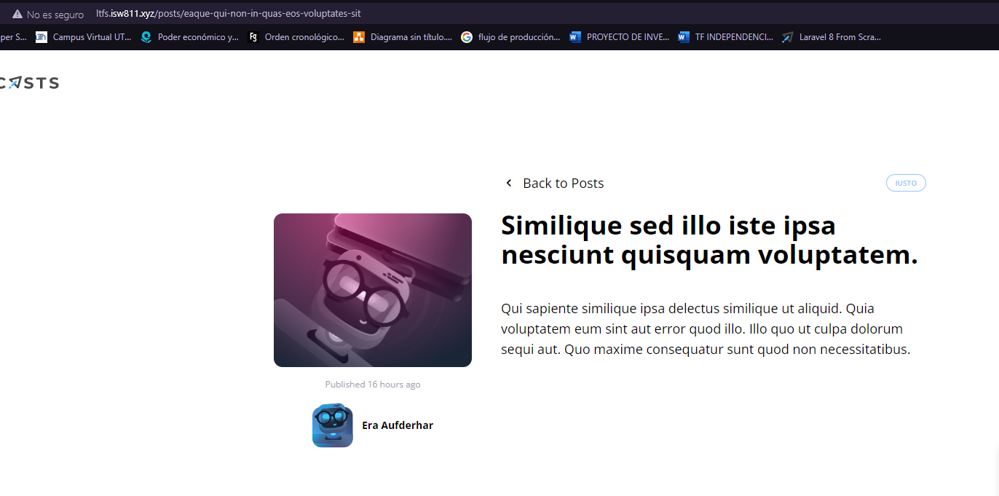

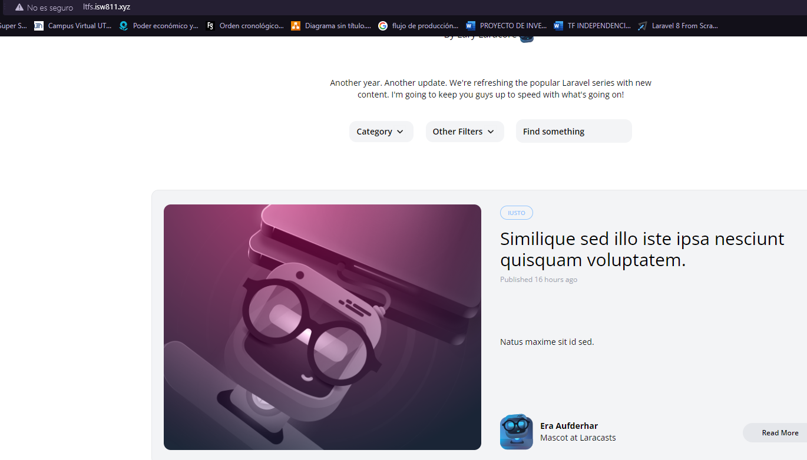

## Capitulo 34
En este trabajó se modificó las vistas para que las categorías sean vistas desde un dropdown con la categoria actual y cuando estas sean elegidas, se muestren las las categorías en el post, la mayoría del video fue realizando y aplicando estilos a los dropdown

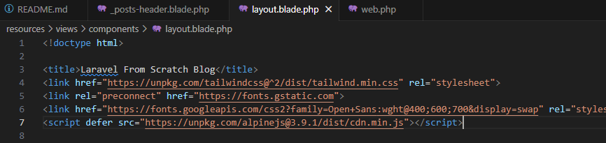

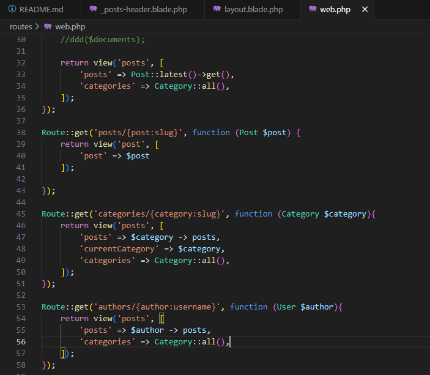

### Añdidos de css a los dropdown y asignacion de los datos de estos mismo
Se le añaden los css y las categorías de la base de datos a los dropdown para que la pagina se vea dinámica, ademas se le añade un código el cual nos permite saber en que categoría nos encontramos  

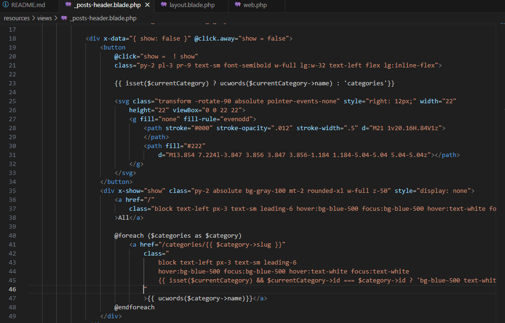

### Reultado de la pagina

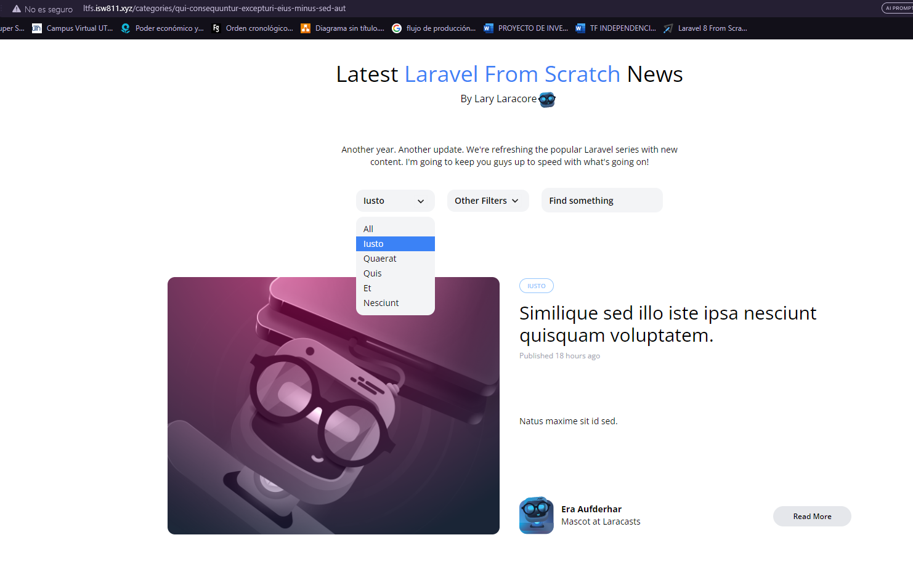

## Capitulo 35

En este capitulo se siguió con el estilizado de los dropdown, ademas de agregar muchos mas componentes los cuales hacen un poco mas sencillo el el codigo debido a que es solo importar los componentes, ocasionando asi que el codigo se vea mas limpio

### Ejemplo de los componentes 

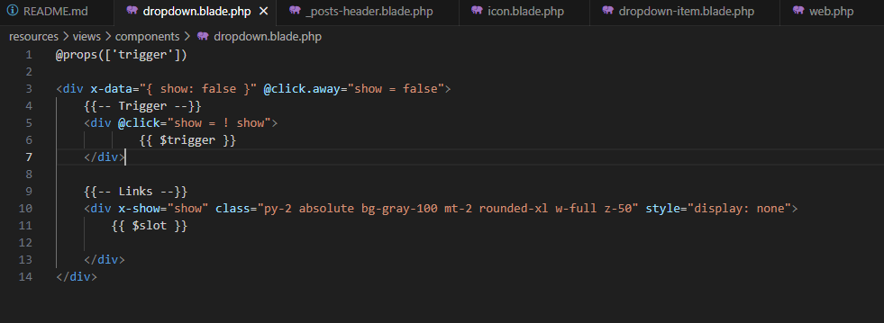

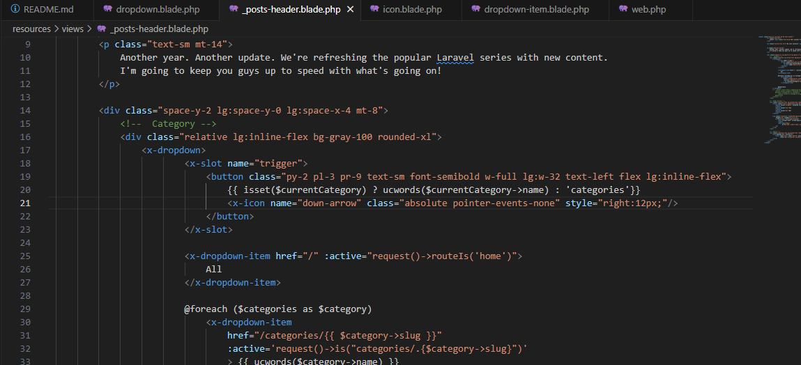

### Resultado del código

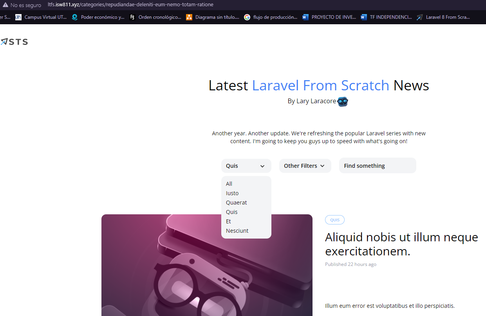

## Capitulo 36

Para esta ocasión, unicamente se realizó una carga de usuarios nueva a la base de datos y se modificó un poco el dropdown para que tuviera un scroll en la lista de categorías, además cuando presionamos una categoría, nos llevará a una pagina donde se encontrará el post con el nombre del usuario que lo creó

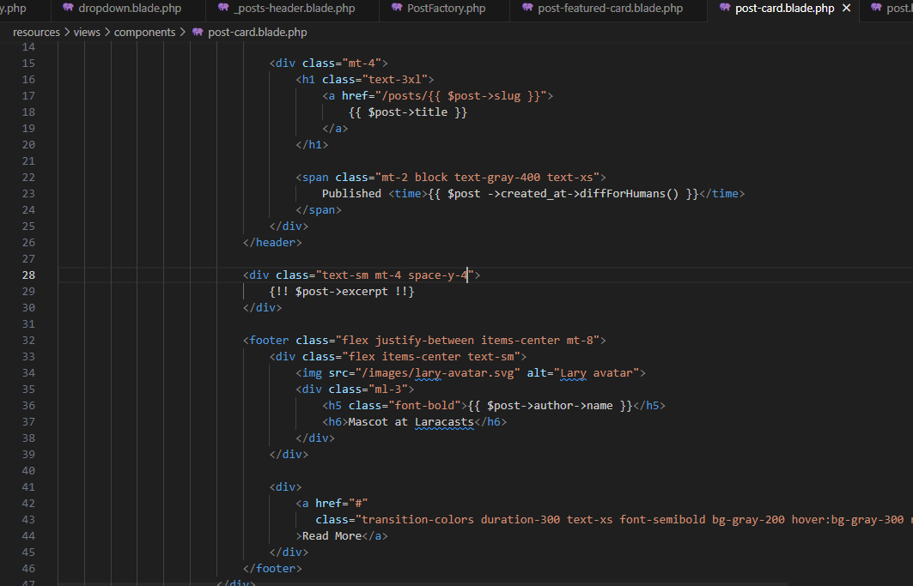

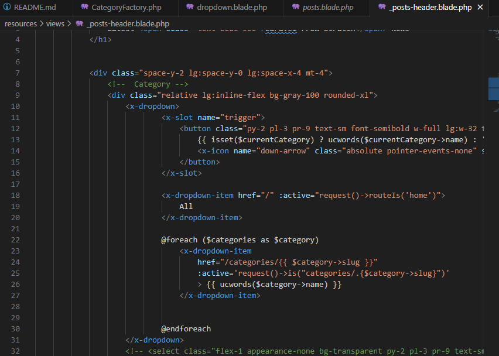

### Resultado de las paginas

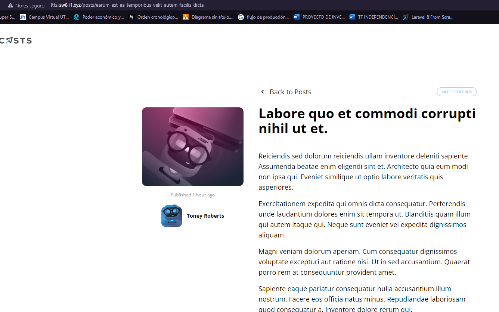

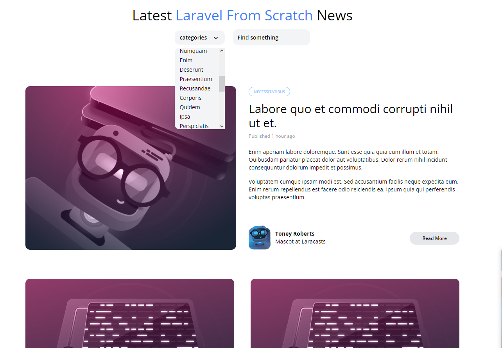
