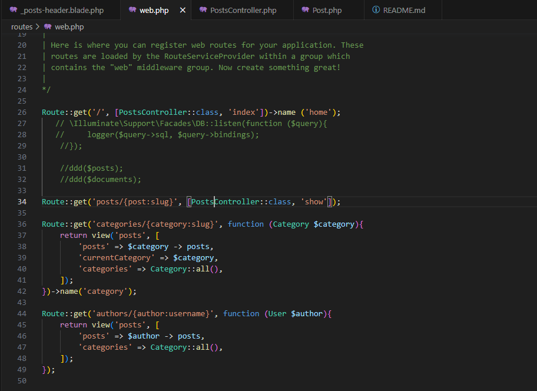
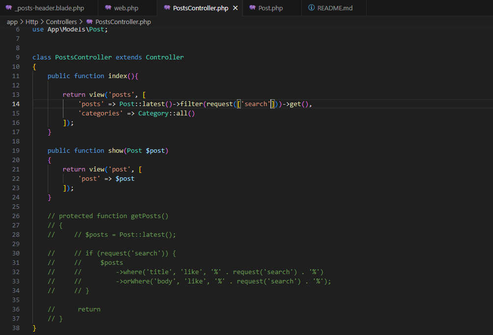
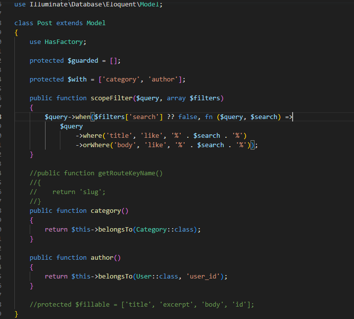

# Entregable proyecto #2

## Indice Sección 6

 Ingresar al [capitulo 37](#capitulo-37)

 Ingresar al [capitulo 38](#capitulo-38)

 Regresar [Al indice principal](../README.md)

 ## Capitulo 37

 En este aprendizaje, se realizó la configuración para el searchbar, para cuando el usuario buscara la noticia de su interés, se modificó el archivo web para que cuando el usuario busque un titulo o una palabra del body, este se muestre al usuario

 ### Cambio del código
 Realizado para que se encuentren los resultados del usuarios y los muestre

 

 

 ### Resultado de la pagina

 

 ## Capitulo 38
 
 Para este capitulo se realizó la modificación del código para el searchbar, refactorizandolo para de una forma el código se vea mucho mas limpio, debido a que no necesita tanto código como el del capitulo anterior y es una forma mucho mas sencilla de crear el searchbar.

 

 

 

