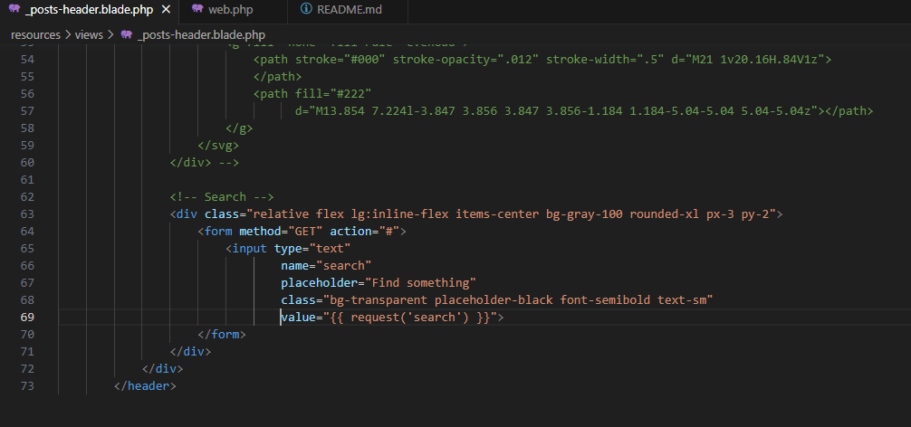
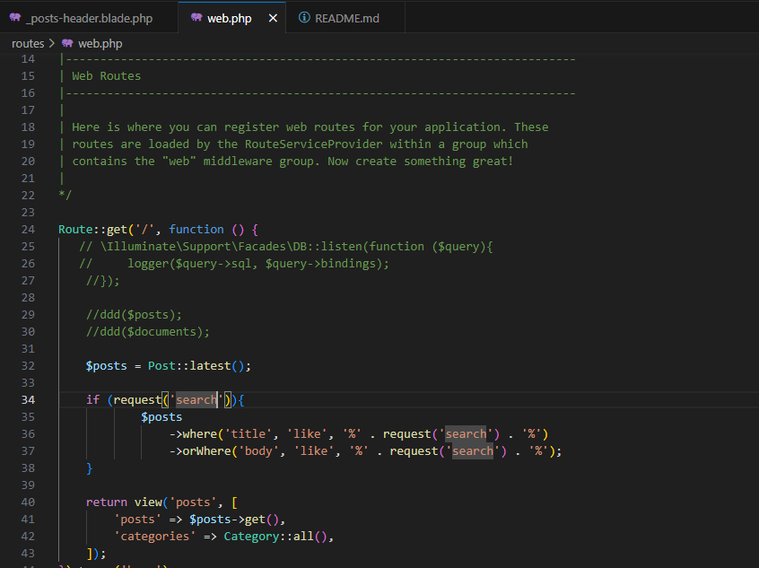
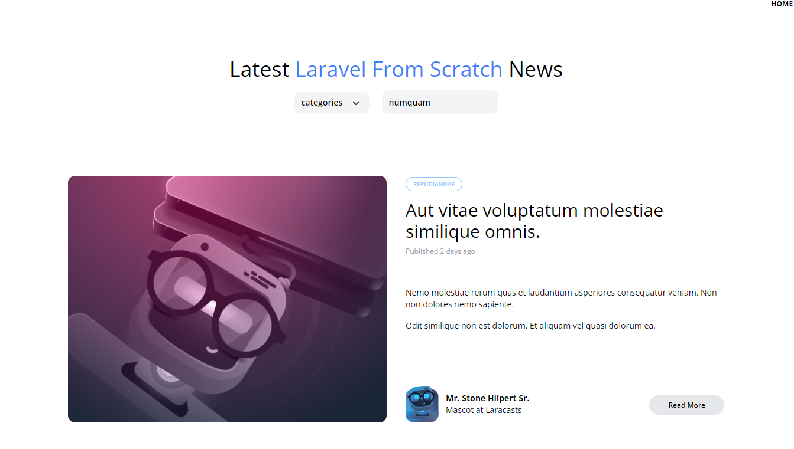

# Entregable proyecto #2

## Indice Sección 6

 Ingresar al [capitulo 37](#capitulo-37)

 ## Capitulo 37

 En este aprendizaje, se realizó la configuración para el searchbar, para cuando el usuario buscara la noticia de su interés, se modificó el archivo web para que cuando el usuario busque un titulo o una palabra del body, este se muestre al usuario

 ### Cambio del código
 Realizado para que se encuentren los resultados del usuarios y los muestre

 

 

 ### Resultado de la pagina

 

## Capitulo 15

En esta ocacion el codigo no se vio muy alterado, en su lugar, se realizó una forma para que todo se vea muy ordenado y disminuyendo asi la cantidad de código al no tener que colocar "@section" o elementos asi, en su lugar simplemente se coloca la etiqueta "x-layout" para incluir todo el contenido de nuestra pagina

## Capitulo 16

Para la elaboración de este trabajó, unicamente se modificaron los archivos "web.php" y el archivo "Post.php" Con el fin de que cuando el usuario escriba mal el url el nombre de algunas de las paginas y esta no sea detectada, se le muestre un mensaje 404

