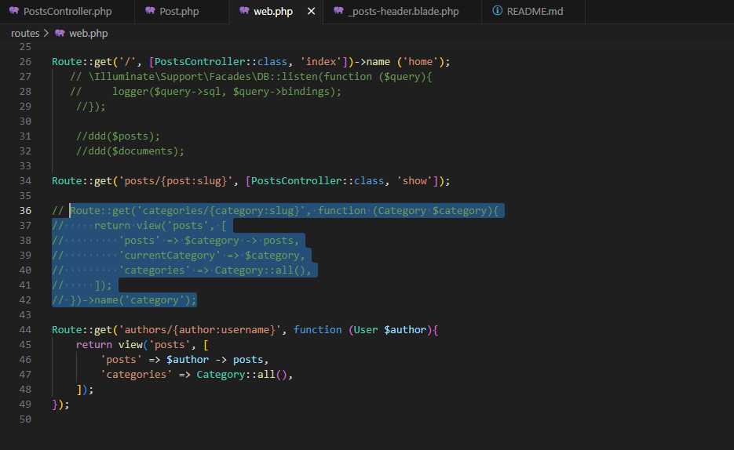

# Entregable proyecto #2

## Indice Sección 7

 Ingresar al [capitulo 39](#capitulo-39)

 Ingresar al [capitulo 40](#capitulo-40)

 ## Capitulo 39

 En esta ocasión se siguió experimentando con el buscador, esta vez lo que se le agregó fue la búsqueda mediante el slug, para cuando el usuario busque la categoría que desea, en el url se nos muestre slug de la categoría asignada

 ### Se comenta el codigo viejo que permitia la busqueda de las categorias mediante el slug y se refactorizó a uno nuevo para que el codigo se vea mas limpio

 

 

 

## Capitulo 40

En esta ocasión creamos un componente llamado x-category-dropdown que pueda obtener cualquier dato que requiera el despegable de la siguiente manera

### Eliminacion del category::all() de los siguientes archivos

### Nuevo código del controlador de post 

## Capitulo 41

Esta vez se modificaron ciertos aspectos para hacerlos mas dinamicos, como a la hora de hacer click al nombre del usuario, este nos llevara a los posts que el usuario creo.

### Se elimina obtener los autores del archivo web

### En su lugar se agrega al archivo Post.php para que busque el autor y nos muestre el username(siempre y cuando estos coincidan)

### Se agregó el autor en el controlador del post

### Se configura el nuevo codigo para que nos muestre los autores

## Capitulo 42

 

