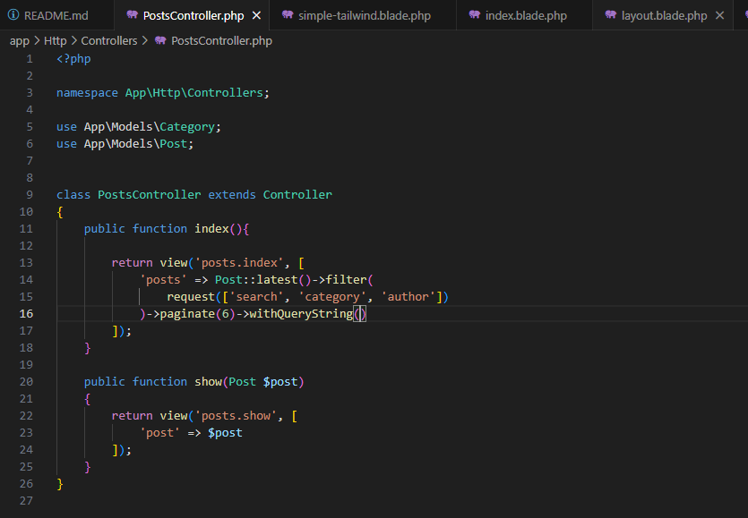
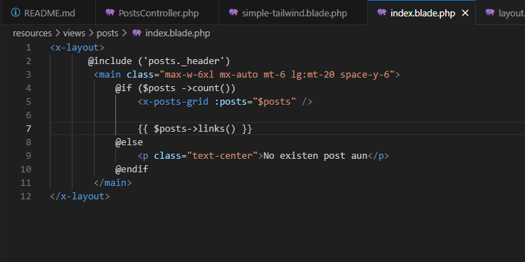
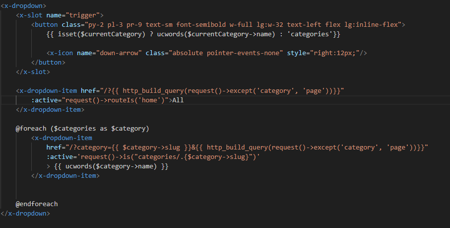
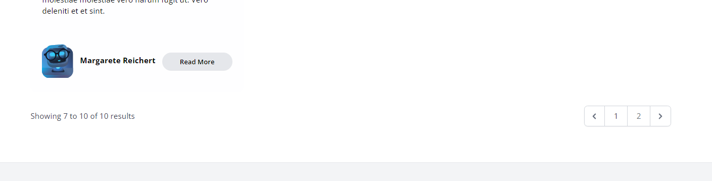
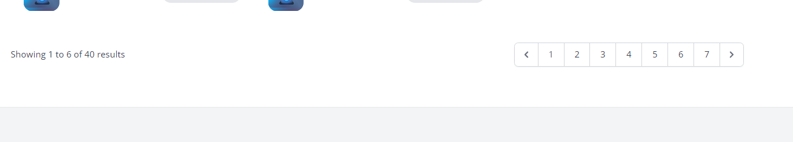

# Entregable proyecto #2

## Indice Sección 8

 Ingresar al [capitulo 44](#capitulo-44)

 Regresar [Al indice principal](../README.md)

 ## Capitulo 44

 En esta ocasión se realizó la paginación de nuestro sitio web, permitiendo asi solo mostrar 6 posts en cada pagina

 ### Primero se debe agregar la palabra paginate para que agregue las paginas que deseamos acceder 

 

 ### Ademas se debe colocar el siguiente codigo para invocar las paginas y sus enlaces en el sitio oficial

 

 ### ahora se debe configurar el archivo de category-dropdown para que en nuestro sitio web se muestren todas las paginas relacionadas con una categoria

 

 ### Resultado de la paginacion con una categoria

 

 ### Resultado con todas las categorias

 

