# Entregable proyecto #2

## Indice Sección 9

 Ingresar al [capitulo 45](#capitulo-45)

 Ingresar al [capitulo 46](#capitulo-46)

 Ingresar al [capitulo 47](#capitulo-47)

 Ingresar al [capitulo 48](#capitulo-48)

 ## Capitulo 45

 En esta ocasión se realizó un registro de usuario, el cual añadirá los datos del usuario como el nombre, el username, email y contraseña

 ### Primero se debe crear las rutas, una para visualizar el formulario y la otra para almacenar los datos

 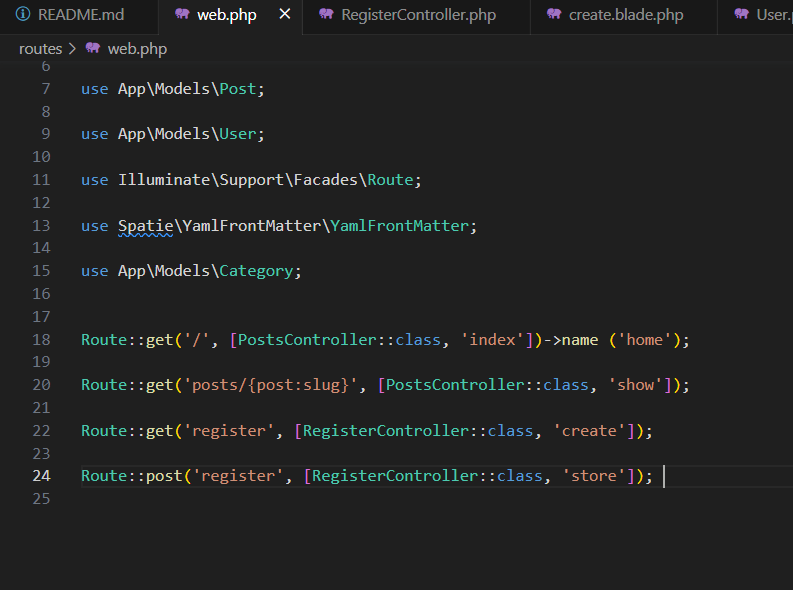

 ### Se colocó una validación de datos, los cuales serán ingresados a la base de datos normal, ademas de agregarle un minimo y maximo de caracteres, si estos requisitos no se cumplen, entonces nos rediccionará al formulario de vuelta

 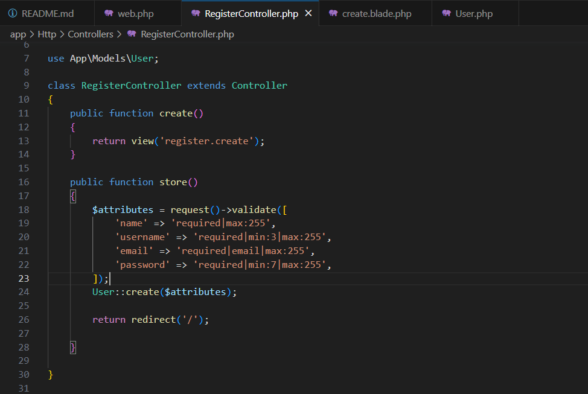

 ### Se configuró el formulario para que el usuario inserte los datos, ademas el @csrf nos da un token el cual nos permite viajar a otra pagina al insertar el boton de registrarse

 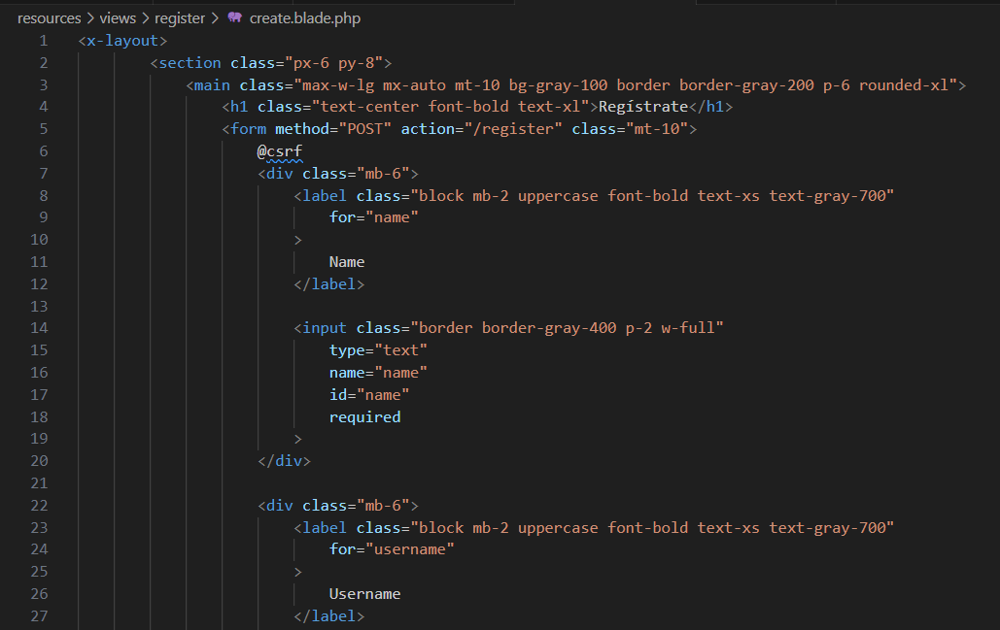

 ### Se configuró el user php para que los datos puedan ser insertados en la base de datos

 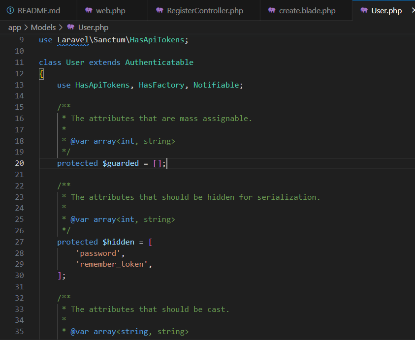

 ### Resultado de la pagina

 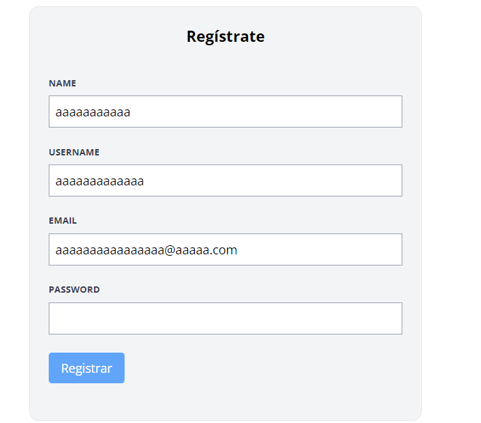

 ### Resultado de la base de datos

 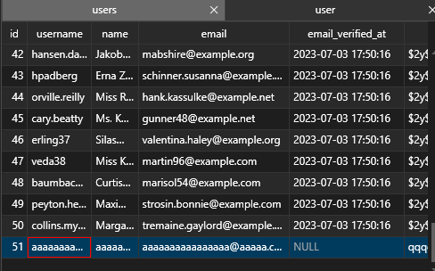

 ## Capitulo 46

 En esta ocasión el único nuevo cambio fue realizar la contraseña encriptada

 ### Configuración en el modelo de usuario para encriptar la contraseña
 
 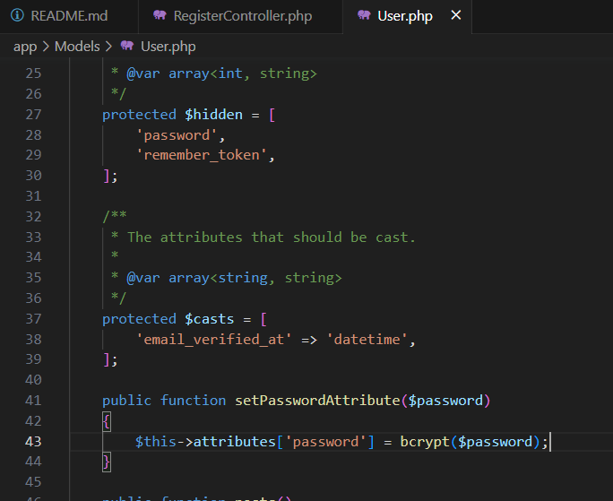

 ### Resultado de la base de datos con las ultimas inserciones encriptadas

 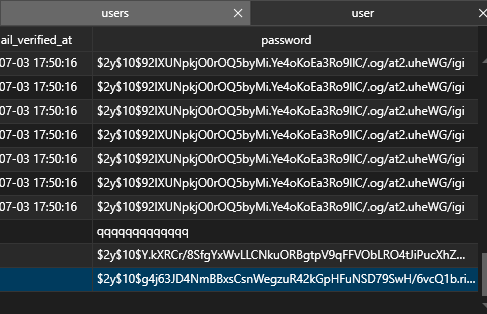

 ## Capitulo 47

 Para esta ocasión, se modificó el formulario, haciendo que cuando un error ocurra, se nos muestre que error fue, ya sea que se intentó agregar un correo ya existente, que la contraseña no cumpla con los caracteres necesarios, entre otros

 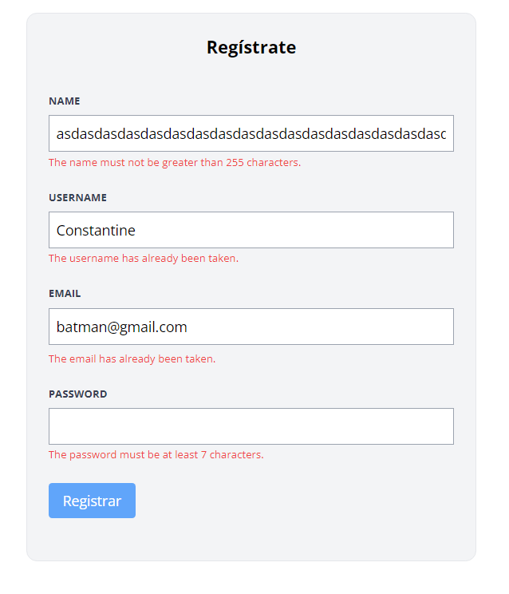

 ### Se le agregó un unique al username y email para evitar datos repetidos en la base de datos y que esto provoque una caida de la pagina 

 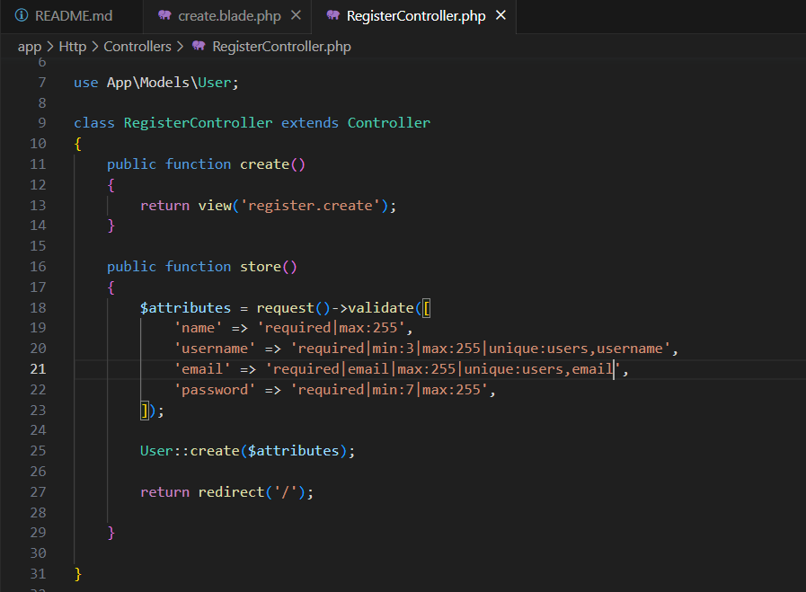

 ### Se le agregó el @error para que cuando el usuario inserte un dato mal, pueda ser visible el porque esta mal

 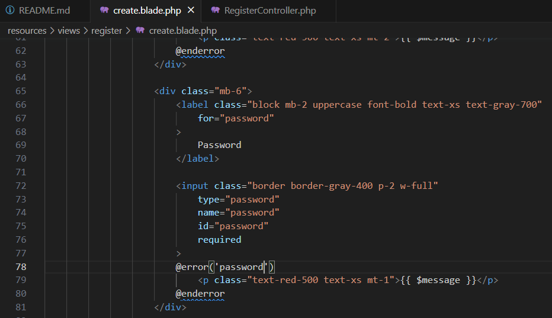

 ## Capitulo 48

