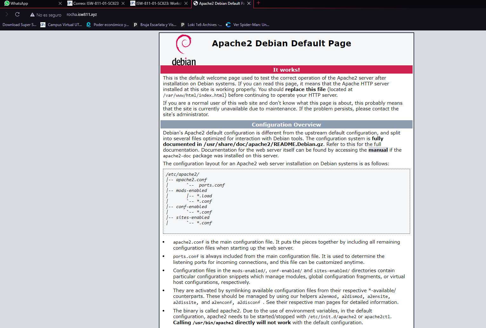

# Workshop 2

## ¿Que necesitamos para desplegar una aplicación web?

- Servidor
- Dominio
- Una IP
- Una App (backend, frontend, fullstack)
- Una base de datos 
- Presupuesto
- Seguridad
    - Firewall
- SEO
    - Analítica
 ## Implementacion de servidor LAMP

 ### Iniciar la maquina
 Primero se debe iniciar la maquina virtual con el comando vagrant up
 ```bash
cd /
cd D
cd isw811
cd VMs
cd webserver
vagrant up
```

### Conectarse mediante ssh
en otra terminal, se debe desplazar a la carpeta y insertar el siguiente comando
 ```bash
cd /
cd D
cd isw811
cd VMs
cd webserver
vagrant ssh
```


 ### Cambiar nombre de host 
 Para cambiar el nombre del host se deben cumplir con los siguientes 
 comandos(debe ejecutarse dentro de la maquina virtual)

 ```bash
sudo hostnamectl set-hostname webserver
exit
vagrant ssh
 ```

  ### Actualizar el hostname en el archivo host
Para completar el cambio del hostname hay que actualizar el nombre de la maquina virtual en el archivo host en GNU/Linux, este archivo se ubica el en /etc/hosts y se puede cambiar usando nano

 ```bash
 sudo nano /etc/hosts

 ```

 ### Actualizar la lista de paquetes elegibles
Antes de instalar primero se debe actualizar la lista de paquetes elegibles 

sudo apt-get update

  ### Instalar la lista de paquetes elegibles
Ahora se debe instalar Vim, cURL, Apache2, MySQL y PHP con el siguiente comando
 ```bash
 sudo apt-get install vim vim-nox \
        curl git apache2 mariadb-server mariadb-client \
        php7.4 php7.4-bcmath php7.4-curl php7.4-json \
        php7.4-mbstring php7.4-mysql php7.4-xml

 ```
  ### Comprobar la IP del Servidor 
Desde la maquina anfitriona, verificar la IP definida en el Vagrantfile, el parámetro private network

 ```bash
  config.vm.network "private_network", ip: "192.168.33.10"
  ping 192.168.33.10

 ```
 ### Ahora se debe ingresar al archivo hosts desde la maquina anfitriona usando un cmd administrador
  ```bash
cd /
cd Windows/System32/drivers/etc
notepad hosts
```
### Una vez abierto el archivo se debe ingresar la ip y colocarle el nombre de nuestra pagina

```bash
192.168.33.10 Rocha.isw811.xyz
```
### Verificar el default de la pagina 
Para realizar la verificación de la pagina solo debemos ir al URL de nuestra pagina Rocha.isw811.xyz
o usando la ip de nuestra pagina 192.168.33.10


### Habilitar modulos 
Ahora se deben habilitar los módulos necesarios para soportar los modulos host virtuales y 
los certificados SSL

```bash
sudo a2enmod vhost_alias rewrite ssl
sudo systemctl restart apache2
```
### Montar carpeta de citios
ahora se deben mejorar los flujos de trabajo sinconizando un folder local con una ruta de la maquina
virtual
```bash
 config.vm.synced_folder "sites/", "/home/vagrant/sites", owner: "www-data", group: "www-data"
```

### Reiniciar la maquina 
Luego de hacer las modificaciones necesarias, se debe reiniciar la maquina virtual
```bash
exit
vagrant halt
vagant up
vagrant ssh
```
### Crear el conf  para el sitio

Se debe crear un archivo conf para cada sitio que se desee hospedar
en el servidor web, por eso se debe crear una carpeta y un archivo .conf
en la maquina virtual
```bash
mkdir confs
cd confs
touch Rocha.isw811.xyz.conf
code Rocha.isw811.xyz.conf
```

### Crear el conf para el sitio 
Esto es lo que deberia ir en el .conf para nuestro sitio

```bash
<VirtualHost *:80>
ServerAdmin webmaster@Rocha.isw811.xyz
ServerName Rocha.isw811.xyz
DirectoryIndex index.php index.html
DocumentRoot /home/vagrant/sites/Rocha.isw811.xyz
<Directory /home/vagrant/sites/Rocha.isw811.xyz>
DirectoryIndex index.php index.html
AllowOverride All
Require all granted
</Directory>
ErrorLog ${APACHE_LOG_DIR}/Rocha.isw811.xyz.error.log
LogLevel warn
CustomLog ${APACHE_LOG_DIR}/Rocha.isw811.xyz.access.log combined
</VirtualHost>

```

### Copiar el conf a sites-available  

En la maquina virtual se debe copiar el archivo .conf de la siguiente manera 
```bash
sudo cp /vagrant/confs/Rocha.isw811.xyz.conf
/etc/apache2/sites-available
```

### Verificar la configuración de apache

Cuando se agrega el archivo .conf es necesario realizar un reinicio de apache 
Pero antes de hacer eso se debe comprobar que no esté ningún error
```bash
sudo apache2ctl -t
```

### Configurar server name 
Si nos da un error a la hora de probar la configuración de apache 
se debe ejecutar los siguientes comandos
```bash
echo "ServerName webserver" | sudo tee -a
/etc/apache2/apache2.conf
```

### habilitar de nuevo el sitio 
se tiene que volver a comprobar la configuración con apache2ctl -t, si ya no aparecen
errores podemos habilitar el sitio con a2ensite, y por último se reinicia
Apache.
```bash
sudo apache2ctl -t
sudo a2ensite Rocha.isw811.xyz.conf
sudo systemctl restart apache2.service
```

### Verificar el sitio
Para verificar nuestro sitio tenemos que ingresar la url de nuestra pagina 


