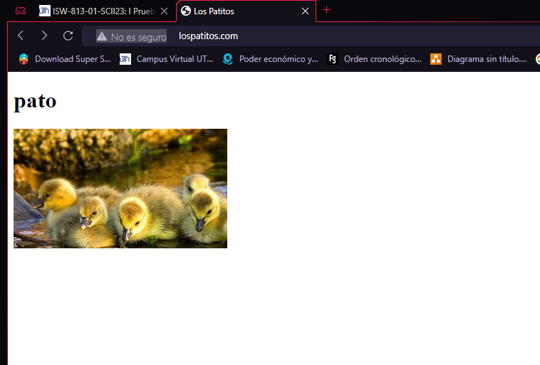

# Workshop 3

 ## Proxy Reverso con Apache2 y habilitar varios sitios al mismo tiempo

 ### Iniciar la maquina
 Primero se debe iniciar la maquina virtual con el comando vagrant up
 ```bash
cd /
cd D
cd isw811
cd VMs
cd webserver
vagrant up
```

### Editar el archivo hosts
Buscar el archivo hosts y editarlo con un cmd como administrador para editarlo
 ```bash
cd /
cd C
cd windows
cd System32
cd drivers
cd etc
notepad hosts
```


 ### Agregar la entrada
 En el archivo hosts se tiene que agregaran las entradas correspondientes para
 realizar los dominios deseados

 ```bash
192.168.33.10 rocha.isw811.xyz #previamente realizada
192.168.33.10 lfts.isw811.xyz
192.168.33.10 lospatitos.com
192.168.33.10 rochablog.com
 ```

  ### Crear el conf para cada sitio
Se debe crear el archivo .conf para cada sitio que se desea hospedar hospedar en el servidor web,
nos debemos dirigir al directorio confs para almacenarlos 
 ```bash
 cd confs
 touch ltfs.isw811.xyz.vonf
 touch lospatitos.com.conf
 touch rochablog.com.conf
 ```

 ### Editar cada conf
Se debe editar cada .conf de los sitios con la información correspondiente de cada sitio
 ```bash
 <VirtualHost *:80>
ServerAdmin webmaster@ltfs.isw811.xyz
ServerName ltfs.isw811.xyz
DirectoryIndex index.php index.html
DocumentRoot /home/vagrant/sites/ltfs.isw811.xyz/public

<Directory /home/vagrant/sites/ltfs.isw811.xyz/public>
DirectoryIndex index.php index.html
AllowOverride All
Require all granted
</Directory>

ErrorLog ${APACHE_LOG_DIR}/ltfs.isw811.xyz.error.log
LogLevel warn
CustomLog ${APACHE_LOG_DIR}/ltfs.isw811.xyz.access.log combined
</VirtualHost>
 ```

  ### Crear folders para sitios
Una vez de crear y configurar cada .conf es necesario crear los folders para todos los sitios
 ```bash
cd sites
mkdir rochablog.com
mkdir lospatitos.com
mkdir ltfs.isw811.xzy
touch rochablog.com/index.html
touch lospatitos.com/index.html
 ```
  ### Conectarse por SSH 
Ahora nos debemos conectar a la maquina virtual y ejecutar el siguiente comando desde una terminal
 ```bash
  cd /
  cd D
  cd isw811
  cd VMs
  cd webserver
  vagrant ssh

 ```
  ### Copiar los confs
Desde la maquina virtual copiamos todos los archivos .conf desde /vagrant/confs al directorio de 
sitios disponibles de apache2 en /etc/apache2/sites-available, con los siguientes comandos
 ```bash
  cd /vagrant/confs
  sudo cp * /etc/apache2/sites-available/

 ```

 ### habilitar los sitios
 desde la maquina virtual copiamos todos los archivos .conf desde el directorio correspondiente,
 se puede proceder con la habilitación de las paginas de la siguiente forma
  ```bash
sudo a2ensite lospatitos.com.conf
sudo a2ensite rochablog.com.conf
sudo a2ensite ltfs.isw811.xyz.conf
```
### recargar apache2
Los sitios habilitados en el paso anterior no estarán disponibles hasta 
reiniciar o recargar la configuración de Apache2, antes de eso es importante
que no se hayan agregado errores en los .conf, todo eso se hace con los 
siguientes comandos
```bash
sudo apache2ctl -t
sudo systemctl reload apache2
```
### Descargar composer
Para utilizar el framework de laravel se debe instalar php en la maquina virtualy instalar composer

```bash
php -r "copy('https://getcomposer.org/installer', 'composer-setup.php);"
php composer-setup.php
rm composer-setup.php
```
### Instalar Composer
Luego de descargar y generar el binario de Composer, debemos reubicarlos y crear un enlace simbólico, para poder invocarlo desde cualquier ubicación

```bash
sudo mkdir -p /opt/composer/
sudo mv composer.phar /opt/composer/
sudo ln -s /opt/composer/composer.phar /usr/bin/composer
```
### Crear Proyecto 
Ahora vamos al directorio de sitios para crear un nuevo proyecto a partir de la plantilla de laravel
```bash
 cd /vagrant/sites
 rm -r ltfs.isw811.xyz
 composer create-project laravel/laravel:8.6.12 ltfs.isw811.xyz
```

### Verificar las paginas
se debe verificar los sitios que creamos



### apagar la maquina virtual
una vez verificada cada una de las paginas debemos usar el siguiente comando

```bash
vagrant halt
```

